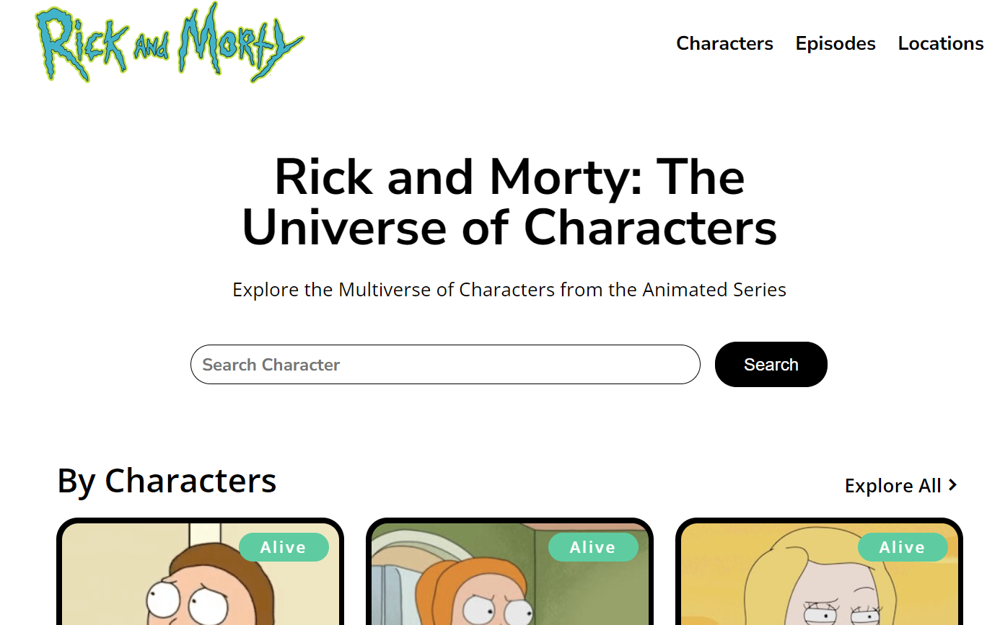
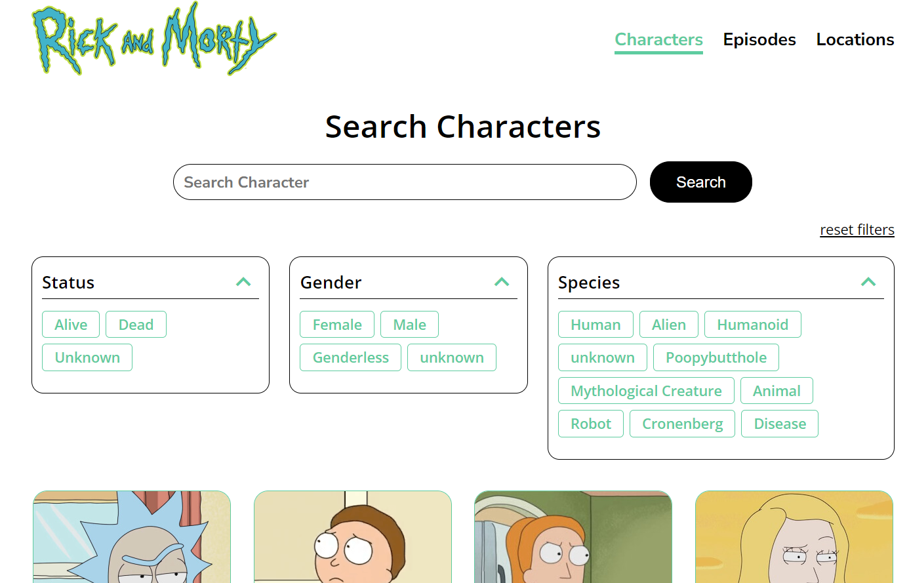
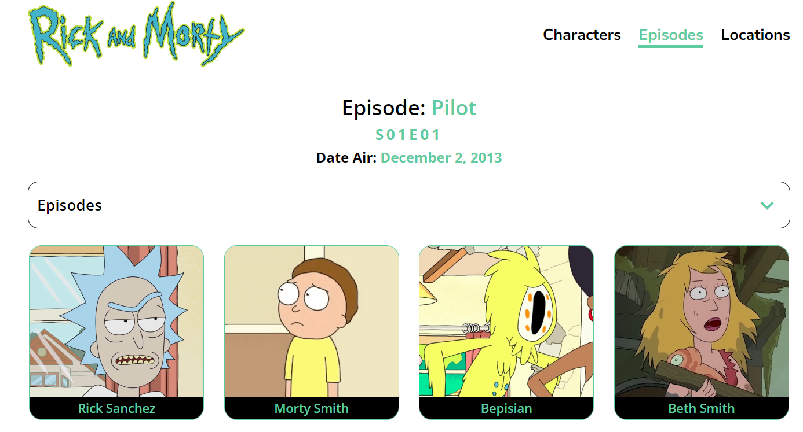
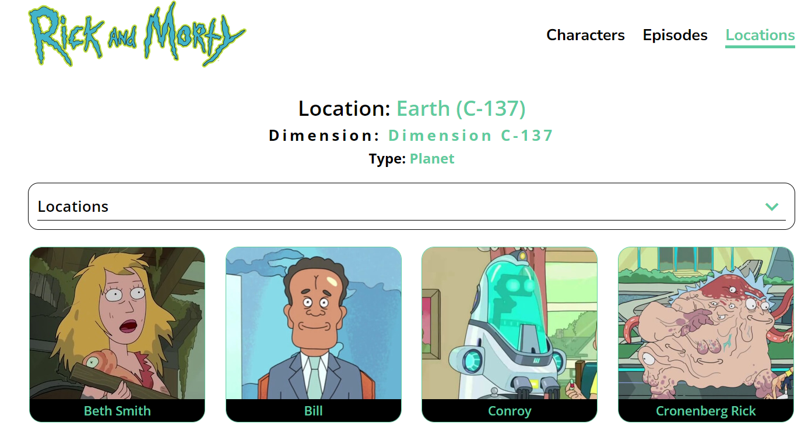

# Rick and Morty React Web

This is a responsive React application that uses the [Rick and Morty API](https://rickandmortyapi.com/). The application provides information about characters, episodes, and locations from the popular TV show Rick and Morty.

## Run Locally

Clone the project

```bash
  git clone https://link-to-project
```

Go to the project directory

```bash
  cd my-project
```

Install dependencies

```bash
  npm install
```

Start the server

```bash
  npm run dev
```

## Demo

To see a demo of this project, please visit the following link:

[Link to demo]

## Screenshots

**Homepage**



**Searchpage**



**Episodepage**



**Locationpage**



## Features

- **Responsive Design**: The application is designed to work on all devices, including desktops, tablets, and mobile phones.
- **Filters**: Users can filter characters by name, gender, specie and status.
- **Pages**: The application includes several pages, including Home, SearchCharacters, SingleCharacterPage, LocationsPage, EpisodePage, and NotFound.
- **Services**: The application uses several services to fetch data from the Rick and Morty API, including getCharacters, getCharacterById, getCharactersByUrls, getEpisodeById, getLocationById.
- **Components**: The application includes several custom components, including CustomSlider, Accordion, MetaTags, Loader.

## Technologies

This project was built using the following technologies:

- **React**: A JavaScript library for building user interfaces.
- **Vite**: A build tool that provides a faster and leaner development experience for modern web projects.
- **CSS Modules**: A CSS file in which all class names and animation names are scoped locally by default.
- **React Router DOM**: A standard library for routing in React.
- **React Helmet**: A document head manager for React.
- **React Slick**: A carousel component built with React.

## License

This project is licensed under the [MIT License](LICENSE).
